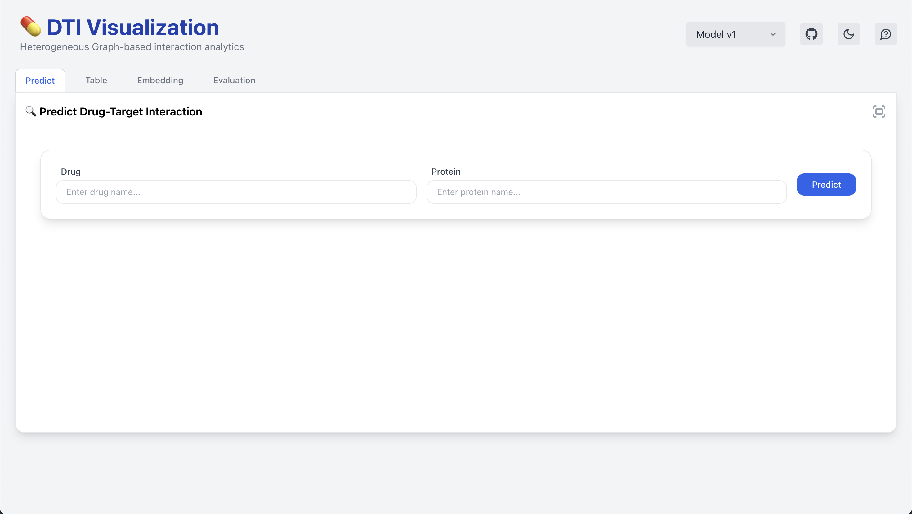

# 🧪 DTI 시각화 웹 프론트엔드

이 프로젝트는 약물-단백질 상호작용 (Drug-Target Interaction, DTI) 예측 모델의 결과를 시각화하고 탐색할 수 있는 웹 기반 플랫폼의 프론트엔드 클라이언트입니다.  
다양한 GNN 기반 모델의 결과를 비교하고, 예측 상호작용을 시각적으로 탐색할 수 있습니다.
---
## 📦 Stacks

- **React 19**
- **TailwindCSS 4**
- **Plotly.js** – 시각화 차트
- **Framer Motion** – UI 애니메이션
- **Firebase Hosting** – HTTPS 기반 배포

---

## 🎯 Features

| 기능 | 설명 |
|------|------|
| ✅ **모델 결과 비교** | 다양한 DTI 모델(HAN, 개선 모델 등)의 예측 결과를 선택·탐색 가능 |
| 🔍 **상호작용 검색** | 약물 또는 단백질 이름을 입력해 Top-N 상호작용 결과를 탐색 |
| 📈 **임베딩 시각화** | 2D 차원 축소를 통한 약물/단백질 분포 시각화 |
| 📊 **평가 지표 제공** | AUROC, AUPR, Accuracy 등을 카드 및 그래프로 요약 제공 |
| 🌙 **다크모드 지원** | 사용자의 환경을 고려한 라이트/다크 테마 전환 |
| 🔄 **자동완성 기능** | 약물/단백질 입력 시 자동 제안 기능 제공 |

---

## Run
1. **Install Dependencies**
   ```bash
   cd client
   npm install
   ```
2. **Set Env Variables**
   - .env 파일 생성 후 아래와 같이 작성
   ```bash 
   API_BASE_URL=http://localhost:8000/api
   ```

3. **Run Dev Server**
   ```bash 
   npm start
   ```
---
## Deployment (Firebase Hosting)
https://capstone-14.web.app/

---

